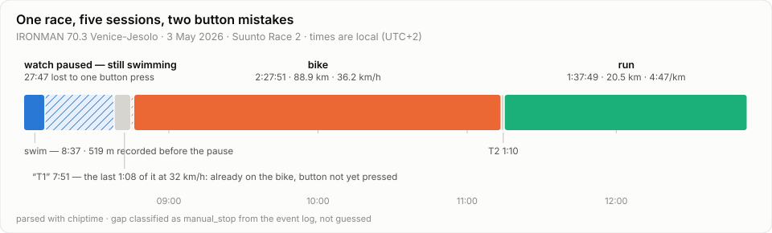
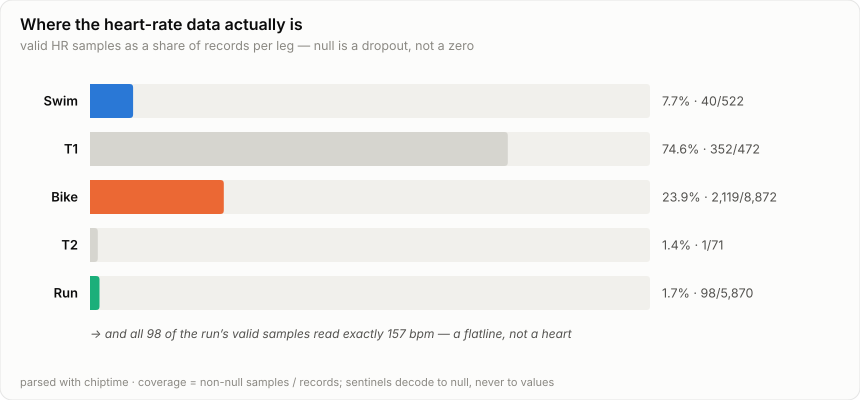
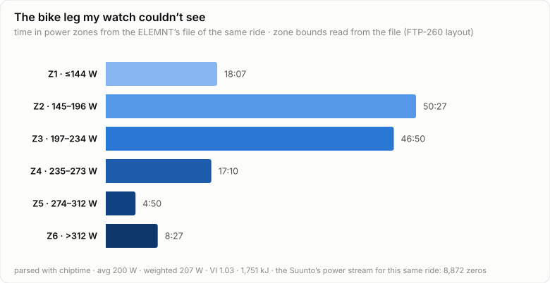
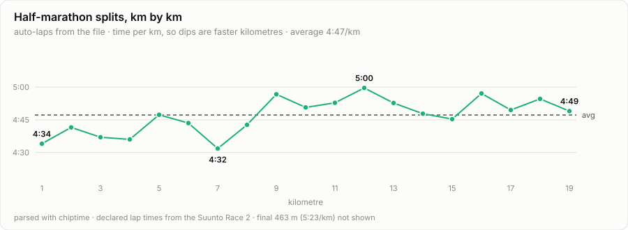

# Inside a triathlon FIT file: what my watch really recorded at IRONMAN 70.3 Venice-Jesolo

On 3 May 2026 I raced IRONMAN 70.3 Venice-Jesolo: 1.9 km in the Adriatic,
90 km of pancake-flat Veneto tarmac, 21.1 km of running along the Jesolo
seafront. My Suunto Race 2 recorded all of it into a single 411 KB `.fit`
file — five sessions, 15,807 records, 4,819 heartbeat intervals, and two
button mistakes I didn't know I'd made until I parsed the file.

I've spent this year building [chiptime](../../getting-started.md), a FIT
parser with a standing rule against taking a workout file's word for
anything. So once the medal was on the shelf, I did what any
data-inclined triathlete with a parser habit would do: I took my own race
apart. Not a race report — a data autopsy. It turned out to be a great
specimen precisely because it's a *healthy* file recorded by a fallible
human — and because, as I discovered when I later exported the ELEMNT
file from my handlebars, this race left behind *two* recordings that
could cross-examine each other.

<!-- more -->

## One file, five sessions

A triathlon FIT file is a *multisport* activity: one file, one timeline,
several `session` messages back to back. One parse call gets all of it:

```python
import chiptime

result = chiptime.parse("venice-70.3.fit")
for s in result.activity.sessions:
    print(s.sport, s.start_time, s.derived.distance_m, s.derived.timer_time_s)
```

```text
swimming    2026-05-03 06:01:46+00:00    519.0     522.0
transition  2026-05-03 06:38:13+00:00   1255.0     471.0
cycling     2026-05-03 06:46:05+00:00  88885.0    8871.0
transition  2026-05-03 09:13:58+00:00     99.0      70.0
running     2026-05-03 09:15:09+00:00  20463.0    5869.0
```

Bike, transitions, run: plausible. But the swim says **519 metres**. The
swim at Venice-Jesolo is 1,900 metres, and I did swim all of it — the salt
in my sinuses was conclusive. So where did 1.4 km of the Adriatic go?

## Mistake #1: the swim that shrank

The CLI summary answers it in one line:

```text
$ chiptime parse venice-70.3.fit
file_type: activity   parts: 1   mode: lenient
device: suunto product=66
session[0] swimming: records=522  distance=519m  elapsed=2187s  timer=522s  ...
gaps: manual_stop(1667s)
```

The swim session's *elapsed* time is 36:27 — about right for my swim. Its
*timer* time is 8:42. The difference is a gap, and chiptime doesn't just
report a hole in the data, it classifies it with evidence:

```python
result.activity.gaps
# [Gap(kind='manual_stop', duration_s=1667.0,
#      evidence='timer stop (manual) at 06:10:23 inside the gap')]
```

Eight and a half minutes into the swim, at the 519 m mark, the watch
recorded a **manual timer stop**. Not a crash, not a dead battery — the
event log shows a deliberate button press, most likely my wrist smacking
the water or a wetsuit sleeve doing the pressing. The timer sat stopped for
27 minutes and 47 seconds while I swam the remaining 1.4 km, and I restarted
it at the swim exit — the next event is a manual start at 06:38:08, and the
GPS track resumes right at the beach.



The distinction matters. A gap that overlaps a stopped timer with a manual
stop event inside it is classified `manual_stop`; the same hole with no
events would be `corruption` or `unknown`, and up to ~25 s with no events is
`smart_recording` — the four look identical if all you do is subtract
timestamps. chiptime never interpolates across any of them: the 519 m the
device measured stay 519 m, the missing 1.4 km are honestly missing, and
the classification tells you *why*.

For what it's worth, the 519 recorded metres were good ones — the first
auto-lap says 1:00 for the opening 100 m (race-start adrenaline, plus a
little open-water GPS optimism), settling to ~2:00/100 m by the fifth.
Every open-water racer knows that shape: sprint for clear water, then the
sea collects its tax.

## Mistake #2: the transition that was secretly a bike leg

Look at the "transition" session after the swim: 7:51 and **1,255 metres**
— a long way to walk barefoot. Its declared max speed is 9.98 m/s, which is
36 km/h. I do not run through transition at 36 km/h.

What happened: I left T1, mounted the bike, and forgot to press the button
that advances a multisport activity to its next leg. The watch kept filing
everything under "transition" until I noticed. The file can't tell you what
I *did* — it faithfully records what I *pressed* — but the streams can
reconstruct reality. Find the moment jogging became riding:

```python
t1 = result.activity.sessions[1]
speed = t1.records.stream("speed").values   # m/s, null where absent
for i in range(len(speed) - 10):
    window = speed[i : i + 10]
    if all(v is not None and v > 4.0 for v in window):
        print(t1.records.time[i], t1.records.stream("distance").values[i])
        break
# 2026-05-03 06:44:57+00:00  1168.0
```

Ten consecutive seconds above 4 m/s starting at 06:44:57. Before that
point: 649 m at a 7.6 km/h average — an actual transition jog. After it:
68 seconds at 32 km/h average, safely on the bike, still labelled
"transition". My real T1 was about 6:45; the remaining 1:08 and 606 m
belong to a bike leg that officially measures 88.9 km in the file but was
really ~89.5.

Two lessons from one race: session boundaries in a multisport file are
*button presses, not ground truth* — and per-second streams are the
receipts that let you audit them. In my defence: if you've never tried
operating a wrist computer during a flying mount with your heart rate in
the 160s and your brain still somewhere in the Adriatic, know that
button-pressing is the first skill to go.

## The heart-rate sensor died quietly, and the file knows exactly how

Here's the summary the watch wrote for the bike leg, next to what the
per-second records actually contain:

```python
bike = result.activity.sessions[2]
bike.declared.avg.heart_rate        # 152  — what the device claims
bike.derived.avg.heart_rate         # 122.8 — mean of the actual samples
bike.discrepancies
# [Discrepancy(field='avg.heart_rate', declared=152.0,
#              derived=122.83, delta=-29.17)]
```

A 29 bpm disagreement between a session summary and its own records is not
a rounding difference — something is deeply wrong, and chiptime's job is to
surface it, not to pick a winner. The coverage numbers tell the story:

```python
hr = bike.records.stream("heart_rate")
valid = [v for v in hr.values if v is not None]
len(valid) / len(hr.values)         # 0.239 — 24% of the ride has HR at all
```



Whatever was measuring my pulse that morning gave up progressively: patchy
in the water, decent through T1, one sample in four on the bike — and then,
for the entire half marathon, **98 valid samples out of 5,870 records, every
single one of them reading exactly 157 bpm**. That's not a heart, that's a
stuck register. If you ever wondered why your platform of choice showed a
suspiciously tidy "avg HR 157" for a race where you nearly turned inside
out — this is what it looks like at the byte level.

Two rules I baked into chiptime's contract make this analysis possible:

1. **Zero ≠ null, always.** A FIT field that's absent decodes to `null`,
   never to `0` — so dropouts can't drag an average down, and coverage is
   measurable instead of invisible.
2. **Declared and derived totals both ship**, with disagreements listed in
   `discrepancies[]`. The device's 152 might come from a sensor-side
   average computed before the samples were lost; the records' 122.8 is
   polluted by whatever garbage the dying sensor did write. Neither number
   deserves your trust, and now you know that — which beats a dashboard
   confidently displaying either one. (Keep this strap in mind: a second
   witness takes the stand in the next section.)

While we're auditing summaries: this file also contains a lap message
claiming a **5,000 m swim lap completed in 8:30**, another claiming
1,000 m of running inside a 70-second transition, and session calorie
counts of 2 kcal for the swim and 661 kcal for the eight-minute T1.
Summary messages are where firmware bookkeeping goes to improvise.
Streams don't improvise.

## The power paradox: 8,872 zeros, and the file that had the answer

The bike power stream is a lovely inversion of the null rule:

```python
power = bike.records.stream("power")
set(power.values)                   # {0} — 100% coverage, all zeros
```

There *was* a power meter on that bike — the Suunto just wasn't paired to
it — so the watch wrote a *literal zero* for every one of the 8,872
seconds of the bike leg. Those aren't sentinels — they're real encoded
values, so chiptime faithfully reports an average of 0 W, and the
analytics layer calls the situation out rather than manufacturing a
number:

```text
session 3: cycling
  2:27:51 · 88.89 km · 36.2 km/h (moving) · avg 0 W · avg HR 123
  COASTING_HIGH: 100% of samples at 0 W (coasting).
```

An all-zero stream with perfect coverage is the signature of *no sensor
paired* — the opposite failure mode of the heart-rate strap (real sensor,
missing values). You need both concepts, zero and null, to tell those
stories apart, which is exactly why chiptime refuses to conflate them.

But the watts weren't lost — the ELEMNT ROAM on my handlebars was running
its own recording, paired to the 4iiii meter the watch never met. Its
file starts at 06:46:07, two seconds after I finally pressed the Suunto's
leg button: minute one of my bike leg was evidently device administration
at 32 km/h (see mistake #2). Parse the second file, and the ride my watch
couldn't see appears in full:

```python
from chiptime import metrics

wahoo = chiptime.parse("venice-bike-elemnt.fit")
ride = metrics.analyze(wahoo).sessions[0]
ride.power_zones["basis"]     # 'file:power_zone' — zones from the file itself
ride.weighted_avg_power       # 207.1
ride.variability_ratio        # 1.035
ride.work_kj                  # 1751.2
ride.power_curve              # {5: 745.2, 60: 279.2, 300: 226.4, 1200: 211.3}
```



Now the bike leg finally makes athlete-sense. 200 W average, 207 W
weighted, and a variability index of 1.035 — on a course with 15 m of
climbing you pick one wattage and defend it, and the file says I did.
Against the FTP-260 zone table the ELEMNT wrote into the file, that's an
intensity right around 0.80: the textbook ceiling for a 70.3 bike, hard
enough to matter, restrained enough to leave a run in the legs. The
4:47/km half marathon that followed is the receipt. The fuelling bill was
1,751 kJ — cycling's tidy coincidence makes that roughly 1,750 kcal
burned before the run even started — and the one moment of drama the
power curve remembers is a 745 W, five-second surge at km 15, from 29 to
40 km/h. Somebody got overtaken properly.

Two recorders, one ride — and the agreement between them is the most
reassuring table in this post:

| | Suunto Race 2 (wrist) | ELEMNT ROAM (bars) |
|---|---|---|
| Distance | 88,885 m | 88,929 m |
| Avg speed (from streams) | 36.2 km/h | 36.6 km/h |
| HR samples heard | 2,119 (23.9%) | 2,120 (24.3%) |
| Declared avg HR | 152 | **77** |
| Power | 8,872 zeros | 200 W avg, 100% coverage |

Forty-four metres of disagreement across 89 km. And the strap gets its
verdict: **two independent recorders each heard ~2,120 heartbeats from a
sensor that only spoke a quarter of the time**, while their two *summary*
averages — 152 and 77 — miss in opposite directions. The culprit even has
a name in the second file's device roster: a Wahoo TICKR, faithfully
logged by a Wahoo head unit while it failed. The autopsy stands,
cross-examined: the strap was the problem, and no single summary number
was ever going to tell me that.

(The ELEMNT file also trips the same `stop → stop_all` shutdown quirk I
dissect in the [Tours teardown](inside-a-wahoo-elemnt-fit-file.md) —
same device, same six-line shutdown handshake, same honest flag in
`discrepancies[]`.)

Meanwhile the Suunto's *run* has genuine power — 100% coverage from its
wrist-based running power model, averaging 260 W. Same field name in the
same file as the 8,872 zeros, completely different provenance. Check
coverage and uniqueness before you trust any stream; it's three lines of
code.

## What held up beautifully

Plenty did — this is a good watch having a hard day, not a bad file.



The run is textbook: 20.46 km at 4:47/km on 1 km auto-laps, fastest
kilometre 4:32, slowest 5:00, a 4.6% positive split that chiptime's
analytics flag without ceremony (`PACING_POSITIVE_SPLIT`). A 4.6% fade is
the polite amount — the kind you negotiate with at km 16 rather than
surrender to, and the direct dividend of that 0.80-intensity bike. The
wrist sensor logged a running cadence of 87.7 rpm — a 175
steps-per-minute metronome that barely wavered. The bike's
sixteen full 5 km auto-laps sit between 7:54 and 8:50 — 36.2 km/h moving
average with a total elevation gain of **15 metres in 88.9 km**, which is
the flattest ride I will ever do. The barometric altimeter spent the whole
race between −9.6 m and +6.2 m and briefly decided the seafront promenade
was below sea level. Venice things.

And a few things you may not know your file contains:

- **4,819 R-R intervals** — beat-to-beat heartbeat timings in 2,391 `hrv`
  messages, exposed as `result.activity.hrv_intervals_s`, recorded even
  while the *displayed* heart rate was failing.
- A developer field named `recovery_time`, registered by an application
  whose 16-byte ID decodes to the ASCII string `SuuntoFitExport1`. After
  the final session it prescribes 318,240 seconds of recovery — 3 days and
  16 hours. The watch wasn't wrong.
- A provenance log for the parse itself: this file's timer events are
  slightly unbalanced across the five sessions (the final leg has a stop
  with no start inside its own slice), so chiptime records
  `TIMER_STOP_SYNTHESIZED` and a `TIMER_STOP_WITHOUT_START` warning instead
  of silently patching things. Every decision the parser makes about your
  data is in `result.provenance` and `result.warnings`, with stable
  machine codes.

## Parse your own race

Everything above is the public API plus one real file:

```bash
pip install chiptime
chiptime parse race.fit            # summary with discrepancies and gaps
chiptime parse race.fit --json     # deterministic canonical JSON
chiptime analyze race.fit          # sport-aware analytics per session
```

The rules that made this teardown possible — never lose data silently,
zero ≠ null, declared *and* derived, classify gaps instead of guessing —
are the reason I started writing chiptime in the first place. They're
pinned down as [the contract](../../concepts/contract.md) and enforced by
a [conformance corpus](conformance-corpus.md) on every commit.

In the companion post I do the same teardown on the opposite kind of
file: the [Wahoo ELEMNT ROAM file from my full-distance IRONMAN bike
leg](inside-a-wahoo-elemnt-fit-file.md) — seventeen streams, near-perfect
sensor coverage, and a shutdown quirk that found a real bug in my own
timer heuristic.

*Total damage in Venice: 4:51:12 from the first beep to the last, two
button mistakes, one dead heart-rate sensor — and, thanks to the second
recorder on the handlebars, a bike leg recovered in full: 200 W held for
2:26, priced exactly right to run 4:47s afterwards. The files remember
everything. You just need a parser that repeats them honestly.*
