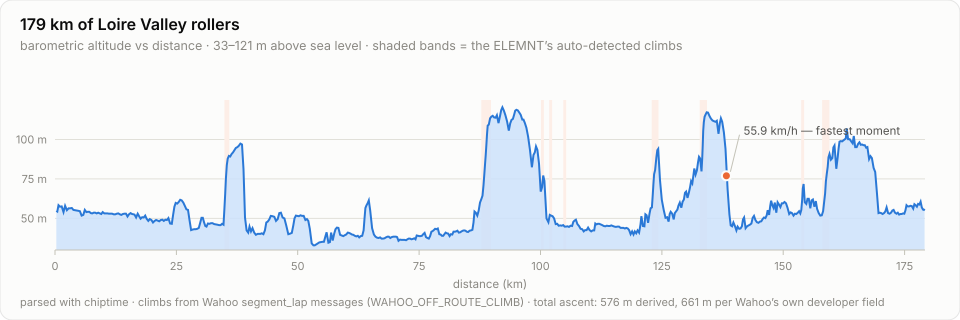
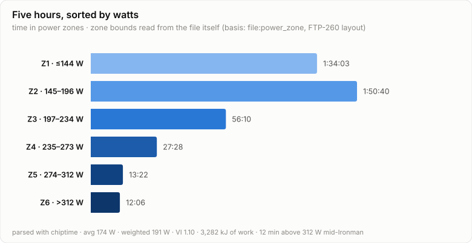
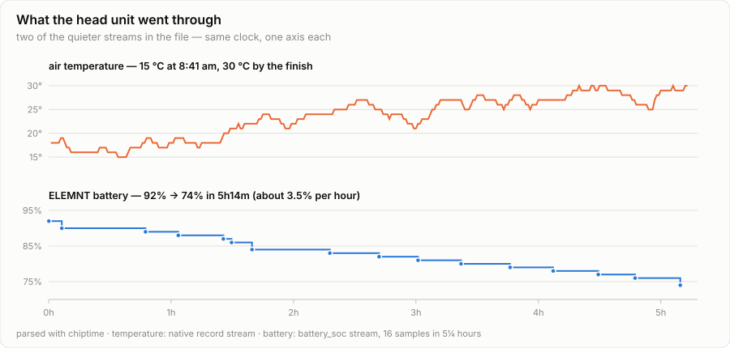
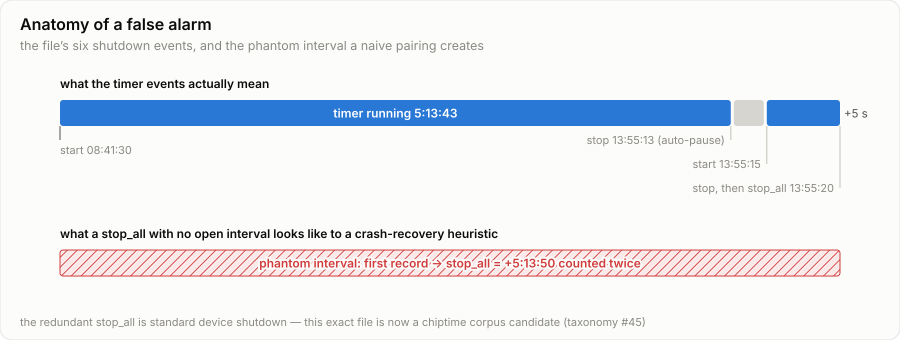

# Inside a Wahoo ELEMNT ROAM FIT file: an IRONMAN bike leg, stream by stream

On 14 June 2026 I rode the bike leg of IRONMAN Tours Métropole — 179 km
through the Loire Valley in 5:13:49, recorded by a Wahoo ELEMNT ROAM into
a 708 KB `.fit` file. Where my [triathlon watch file from
Venice](inside-a-triathlon-fit-file.md) was a study in sensor failure and
button mistakes, this one is the opposite specimen: 18,828 records, one
per second for five and a quarter hours, with **seventeen parallel data
streams and almost nothing missing**.

It's the perfect file for a different question: what does a modern bike
computer *actually* write when everything works? And since I build
[chiptime](../../getting-started.md), my own race files double as its
sternest code reviewers — this one, in its final five seconds, filed a
genuine bug report. Let's take it apart.

<!-- more -->

## The sensor roll call

A FIT file doesn't just log your ride; it logs the equipment that logged
your ride. This file contains 315 `device_info` messages describing every
piece of hardware on the bike:

```python
import chiptime

result = chiptime.parse("tours-bike-leg.fit")
for m in result.messages:
    if m.name == "device_info" and m.get("product_name"):
        print(m.get("manufacturer"), m.get("product_name"),
              m.get("source_type"), m.get("charge"))
```

Deduplicated, the cast list reads:

| Device | Detail |
|---|---|
| Wahoo ELEMNT ROAM | firmware 170.81, hardware rev 8, serial included |
| 4iiii power meter | ANT+, battery status "good", firmware 12 |
| Shimano Di2 | electronic shifting, reporting **100% charge** |
| Heart-rate sensor | appears twice — once over ANT+, once over Bluetooth LE |
| GPS, barometer, thermometer, accelerometer | the ROAM's internal sensors |

The head unit also logs *itself* as a sensor, dropping a breadcrumb with
its battery percentage every quarter hour or so. Your bike computer keeps
a diary about its own battery anxiety; more on that below.

## Developer fields: the file has sockets for everything

The FIT format lets applications register custom fields at runtime —
*developer fields* — and the ELEMNT firmware registers **sixteen** of
them across fourteen developer indexes, a little map of everything
Wahoo's ecosystem can plug in:

```python
for m in result.messages:
    if m.name == "field_description":
        print(m.get("field_name"), m.get("units"))
```

```text
calibration adc            travel_assist_level None
charge %                   lev_travel_assist_level_time_in_zone ms
running_smoothness %       ascent m · descent m
crank_length mm x 10       auto_lap_duration s · auto_lap_distance m
glucose mg/dL              serial_number · workout_type
skin_temp deg C            lap_distance_before_snap cm · fit_date_time s
```

Read that list again: a socket for a continuous glucose monitor
(`glucose`, mg/dL), a socket for an e-bike's assist level
(`travel_assist_level`), the physical `crank_length` of the power meter's
host crank, even `skin_temp`. My ride only exercises two of them —
`ascent` and `descent` arrive as full per-second streams tagged
`developer:wahoo_fitness` — but the sockets ship in every file. chiptime
keeps developer streams alongside native ones, with the provenance visible:

```python
ascent = result.activity.sessions[0].records.stream("ascent")
ascent.source          # 'developer:wahoo_fitness'
ascent.values[-1]      # 661 — Wahoo's cumulative climbing, in metres
```

One wrinkle worth knowing: Wahoo registers developer index `0` **twice**
in this file, with different field layouts (first `calibration`, later
`descent`/`fit_date_time`/`skin_temp`). Index redefinition mid-file is
legal-but-spicy FIT, and chiptime flags it rather than guessing:

```text
warning: [DEV_INDEX_REDEFINED] developer_data_index 0 redefined by another
application mid-file; later definitions apply forward
```

And Wahoo's climbing number? 661 m, versus 576 m when chiptime re-derives
ascent from the barometric altitude stream with its own thresholding. Both
are honest answers to slightly different questions — which is exactly why
the file carries both and the parser shows its work.

## The ride, as seventeen streams tell it

Every second of this file carries position, speed, distance, altitude,
grade, heart rate, power, cadence, temperature, GPS accuracy, calories,
left-side pedal smoothness and torque effectiveness, Wahoo's
ascent/descent pair, and periodic battery state. Coverage is 98–100% on
nearly all of them — after the Venice file, it feels almost suspicious.



The Loire Valley serves rollers, not mountains: the whole ride lives
between 33 m and 121 m of altitude, grades between −11.3% and +10.2%. The
ROAM's climb detection engine filed nine `segment_lap` messages with the
UUID prefix `WAHOO_OFF_ROUTE_CLIMB` — the on-device "Summit" feature
noticing hills I hadn't loaded a route for. It named them "1" through "7",
using "4" three separate times, which is exactly the kind of detail you
only learn by reading the raw messages.

The power story comes straight from the analytics layer. Zones need no
configuration here, because **my zone table is in the file** — the ELEMNT
writes `power_zone` and `hr_zone` messages, and the resolution ladder I
gave chiptime is explicit settings → in-file zones → honestly absent,
never estimated:

```python
from chiptime import metrics

report = metrics.analyze(result, metrics.AthleteSettings(ftp_w=260))
s = report.sessions[0]
s.power_zones["basis"]     # 'file:power_zone' — read from the file itself
s.weighted_avg_power       # 191.4
s.variability_ratio        # 1.098
s.work_kj                  # 3281.5
s.power_curve              # {5: 643.6, 60: 335.4, 300: 231.5, 1200: 195.8}
```



That's an Ironman bike leg in four numbers: 174 W average, 191 W weighted,
intensity ~0.74 of the file's FTP-260 zone layout, 3,282 kJ of work — and
a variability index of 1.10 that would have been closer to 1.05 if the
course hadn't kept serving punchy rollers (12 minutes above 312 W is *not*
the textbook way to ride the first half of an Ironman; the textbook and I
have agreed to differ). For calibration: [my 70.3 bike six weeks
earlier](inside-a-triathlon-fit-file.md) came out at VI 1.035 — flat
course, one wattage, defended all day. The Loire kept asking questions.

The 3,282 kJ is also the fuelling bill. Cycling's tidy coincidence —
mechanical kJ and metabolic kcal nearly cancel — makes that roughly 3,300
kcal burned, of which a stomach at race intensity can absorb maybe half.
The other half is a debt, and the marathon is the collector. The insights
layer reads the fatigue for free:

```text
PACING_POSITIVE_SPLIT: Second half 10.9% slower than the first.
HR_DRIFT_HIGH: Output per heartbeat fell 8.6% from first half to second — aerobic drift.
```

First half 35.4 km/h, second half 32.9. Heart rate drifting *down*
(156→152) while power fell faster — heat and five hours doing what they
do to everyone: the same heartbeat buying fewer watts. The fastest moment
of the day — 55.9 km/h at km 138 — was, of course, downhill. And across
5 hours 13 minutes of racing, the speed stream registers a standstill for
a grand total of **4 seconds**: an Ironman bike leg has no red lights, no
café stops, and no mercy.

Two streams you probably never look at deserve a frame of their own:



The thermometer tells the race-nutrition story better than I could — a
15 °C morning start turning into a 30 °C early afternoon, one degree at a
time: the full span from arm-warmer weather to warm-bottle weather, with
a marathon still owed at the end of it. The battery log answers a
question every long-course athlete has asked: an ELEMNT ROAM burns about
3.5% per hour with three ANT+ sensors, Di2, and full-time GPS. It would
have survived a double.

## The cadence disagreement that's really a definition

chiptime cross-checks every session summary against the streams it came
with, and two fields disagree here. The first is small but instructive:

```python
result.activity.sessions[0].discrepancies
# [Discrepancy(field='timer_time_s', declared=18828.0, derived=37658.0, ...),
#  Discrepancy(field='avg.cadence',  declared=83.0,    derived=78.06,  ...)]
```

The ELEMNT says my average cadence was 83 rpm; the mean of the 18,828
cadence samples is 78. Neither is wrong. About 4.6% of the samples are
*literal zeros* — coasting, feet still, a real measurement of a real
state — and Wahoo's average excludes them while chiptime's includes them,
because chiptime's contract says zero is data (`0` W of coasting and a
dropout are different facts, and a parser must never blur them). Filter
the zeros yourself and the stream mean lands at 81.8, within arm's reach
of the head unit's number; the residue is vendor smoothing. The point of
`discrepancies[]` isn't to crown a winner — it's that you got to *see*
the disagreement and decide what your analysis should do about it.

## The 37,658-second timer, or: how this file caught a real bug

The other discrepancy is not small. The device declares a timer time of
18,828 s (5:13:48). Rebuilding timer state from the file's event log,
chiptime derived **37,658 s — almost exactly double**. One of those
numbers is a 10½-hour bike split, and I want it on record that I was not
out there that long.

The event log is six lines, and it's worth reading like a detective:

```text
timer start     08:41:30   (manual — race morning, mount line)
timer stop      13:55:13   (auto  — rolling to a stop at bike-in)
timer start     13:55:15   (auto  — two seconds of dismount shuffle)
timer stop      13:55:20   (manual)
timer stop_all  13:55:20   (manual — same second)
session stop_disable_all   13:55:20
```

A `stop` followed by a `stop_all` in the same second is the ELEMNT's
standard shutdown handshake — belt and braces, written by thousands of
devices at the end of every ride. But I'd given chiptime's timer state
machine a defensive heuristic for crash-truncated files (taxonomy #45):
*a stop with no preceding start opens an interval at the first record*.
When the redundant `stop_all` arrived with no interval open, that
heuristic fired — and manufactured a phantom interval spanning the entire
ride:



18,823 s of real riding + 5 s of dismount shuffle + 18,830 phantom seconds
= 37,658. The device's number was right; the derived number was my own
heuristic misreading a completely ordinary shutdown pattern.

Here's the thing, and it's the whole reason I built the discrepancy
system: **this is what working looks like**. The wrong number didn't
sneak into an average or quietly inflate a training-load metric — it
arrived loudly, in `discrepancies[]`, next to the declared value and a
`TIMER_STOP_WITHOUT_START` warning, with the event log preserved for
anyone to replay. A discrepancy flag is a starting gun, not a verdict:
this one sent me straight to the six events above, and this exact
shutdown pattern went straight into chiptime's backlog as a taxonomy #45
sub-case, with this file destined for the [conformance
corpus](conformance-corpus.md) so the fix can never regress. A parser
that shows its work can be caught out — in this case by me, on my own
race file — and that's precisely the property you want in one.

*(Until that fix lands: the two-interval arithmetic from the event log —
18,828 s — is the number to trust, as the device declared.)*

## Also in the file, filed under "who knew"

- A `workout` message titled, with Wahoo brevity, `Cycling`.
- The rider's full **heart-rate zone table** (`hr_zone` × 5) alongside the
  power zones — this ride spent 3:37 of 5:14 in HR zone 4 (152–173 bpm).
- 46 messages chiptime doesn't recognize (`unknown_65280/65281/65284`,
  Wahoo-proprietary) — parsed, preserved, and passed through rather than
  dropped. Unknown data is never fatal and never silently lost.
- A `gps_accuracy` stream averaging 1.1 m for five hours. The Loire
  Valley has excellent sky.

## Parse your own ride

```bash
pip install chiptime
chiptime parse ride.fit              # summaries, discrepancies, warnings
chiptime analyze ride.fit --ftp 260  # zones from the file, load, insights
chiptime parse ride.fit --json       # every stream, deterministic JSON
```

The principles this teardown leaned on — zero ≠ null, declared *and*
derived with disagreements surfaced, unknown messages preserved, every
parser decision in a machine-readable log — are the
[contract](../../concepts/contract.md) I hold chiptime to, pinned by a
conformance corpus that this very file is about to make one case
stronger.

*Final tally for Tours: 179.2 km, 5:13:49, 3,282 kJ, fifteen degrees of
warming, 18% of a battery, one parser bug flushed out of hiding. A good
file's idea of a plot twist.*
